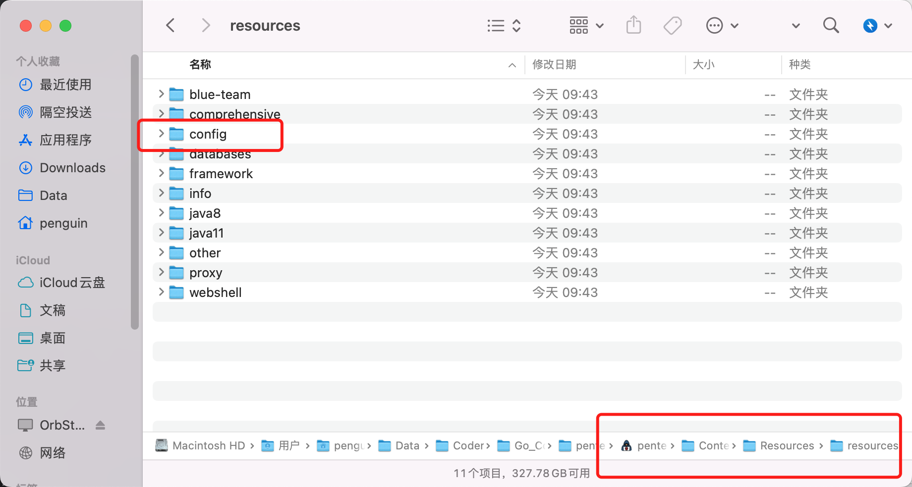

# PMT

Pentest_Mac_Tools

## 简介
来源是SSP安全的师傅，一直有这个想法。但是老懒狗了，看到师傅的项目就给略微修改了一下

https://mp.weixin.qq.com/s/CWpj57CX8Uqxa4uTGs7HcQ


## 编译-特点
把工具箱依托 Go 语言的高效简洁 基于fyne GUI框架进行编写。

特点一：本工具箱为一个app单文件可以随意存放，并且可以双击直接打开使用， 拖到应用程序文件夹中即可将工具箱固定在dock栏中。

特点二：本工具箱打开工具基本为秒开， 几乎没有延迟， 纵享Mac丝滑。

特点三：源代码简单，使用者可根据自己的使用习惯，对工具进行修改二开。 

特点四: 支持自定义工具，写YAMl文件就可以了

如果想编译，请安装fyne然后使用fyne编译，具体可见build.sh

## 自定义工具
分为java8 java11 然后目前还没搞打开终端。就默认了open
```yaml
  - CategoryName: Database_utilization_tools
    Tasks:
      - TaskName: OracleShell v0.1
        PATH: resources/databases/OracleShell/oracleShell.jar
        VALUE: Java8
        COMMAND: -jar
        Optional:
      - TaskName: Erfrp
        PATH: resources/proxy/Erfrp/.
        VALUE: Open
        COMMAND: .
        Optional:
      - TaskName: 哥斯拉 v4.0.1
        PATH: resources/webshell/Godzilla/godzilla.jar
        VALUE: Java11
        COMMAND: -jar
        Optional: -Xdock:icon=godzilla.icns -Dfile.encoding=UTF-8
```
根据这种格式在resources/config目录下的config.yaml自定义就行了

编译后会出现右键现实包内容
pentest_mac_tools


编译后的效果，如果想自定义就在config目录编辑config.yaml就行了


resources目录的资源


链接: https://pan.baidu.com/s/1Li4tk-yW09VF_GNgD9v8Uw?pwd=rpxa 提取码: rpxa 
--来自百度网盘超级会员v6的分享